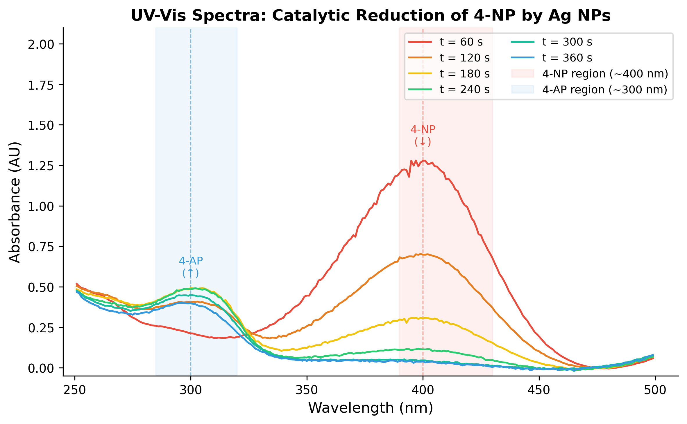
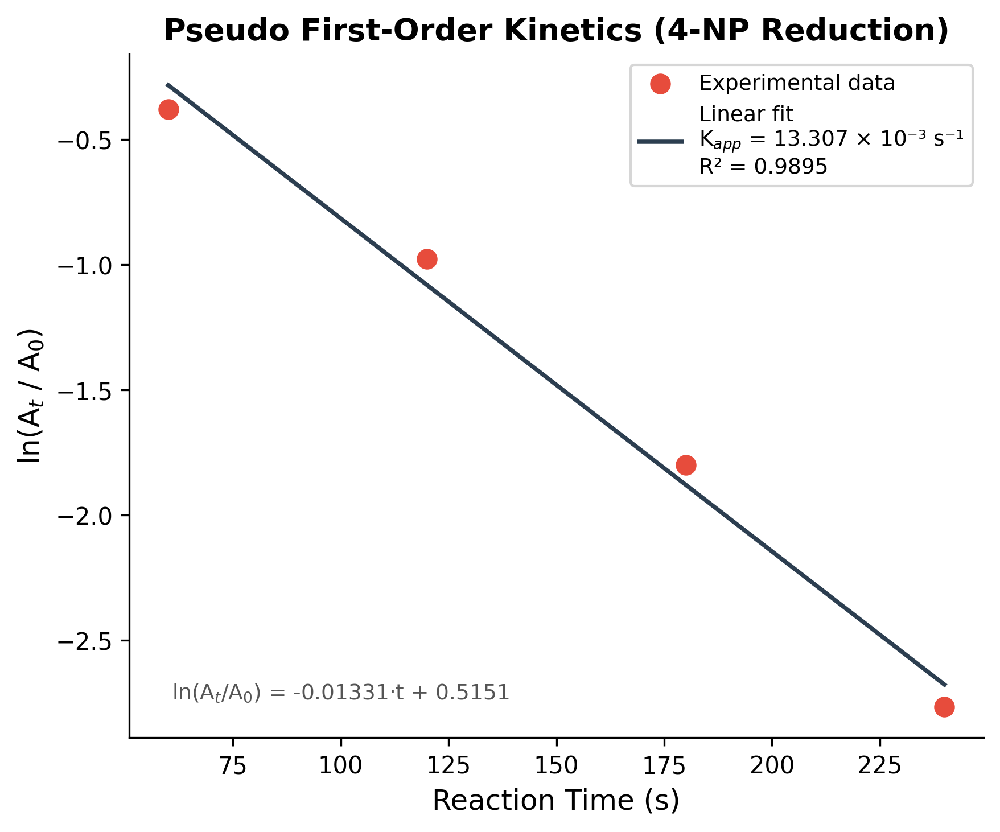
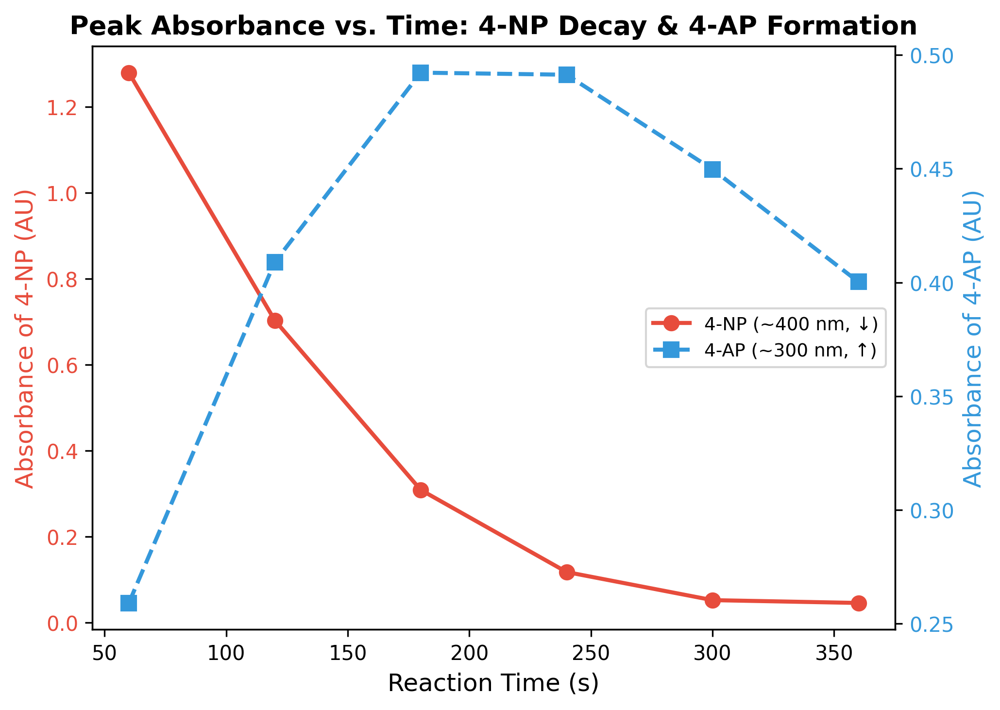

# UV-Vis Spectroscopy Analysis — Catalytic Reduction of 4-NP by Ag NPs

> **2026-1 기기분석실험** | UV-Vis 분광광도계를 이용한 은 나노입자(Ag NPs) 촉매 반응 속도 분석

---

## Overview

은 나노입자(Ag NPs)에 의한 **4-니트로페놀(4-NP) → 4-아미노페놀(4-AP) 환원반응**을 UV-Vis 분광광도계로 추적하고, 유사 1차 반응속도론(pseudo first-order kinetics)으로 겉보기 속도 상수(*K*<sub>app</sub>)를 정량합니다.

| 항목 | 값 |
|---|---|
| 반응물 (4-NP) 흡수파장 | ~400 nm |
| 생성물 (4-AP) 흡수파장 | ~300 nm |
| *K*<sub>app</sub> | **13.31 × 10⁻³ s⁻¹** |
| R² | **0.9895** |
| 반감기 (*t*½) | **52.1 s** |
| 기준파장 | 399.95 nm |
| 적합 범위 | t = 60–240 s |

---

## Results

### Figure 1 — Time-Series UV-Vis Spectra

시간에 따른 UV-Vis 스펙트럼 변화. 400 nm의 4-NP 피크가 감소하고 300 nm 영역의 4-AP 피크가 증가하는 것을 확인할 수 있다.



- **빨간 음영 (390–430 nm)**: 4-NP 흡수 영역 — t=60 s에서 A=1.27, t=240 s 이후 noise floor 수준으로 소멸
- **파란 음영 (285–320 nm)**: 4-AP 흡수 영역 — t=120 s부터 명확한 피크 출현, t=180–240 s에서 최대

---

### Figure 2 — Pseudo First-Order Kinetics Fit

ln(A<sub>t</sub>/A<sub>0</sub>) vs. 반응시간의 선형 회귀. Beer-Lambert 법칙을 통해 농도를 흡광도로 대체하여 유사 1차 속도론 적용.



$$\ln\left(\frac{A_t}{A_0}\right) = -K_\text{app} \cdot t + c$$

| 파라미터 | 값 |
|---|---|
| *K*<sub>app</sub> | 13.31 × 10⁻³ s⁻¹ |
| 절편 (*c*) | 0.5151 |
| R² | 0.9895 |
| *t*½ = ln 2 / *K*<sub>app</sub> | 52.1 s |

> t=300, 360 s 데이터는 흡광도가 noise floor(~0.05 AU) 수준이므로 회귀에서 제외.

---

### Figure 3 — Peak Absorbance vs. Time (Dual Axis)

4-NP 소멸과 4-AP 생성의 시간 의존성을 이중 Y축으로 시각화. 반응물 감소와 생성물 증가의 반상관 관계를 명확히 보여준다.



- **4-NP (빨간 실선, 좌축)**: t=60 s (A=1.28) → t=360 s (A≈0.05), 단조 감소
- **4-AP (파란 점선, 우축)**: t=180–240 s에서 최대 (A≈0.49), 이후 소폭 감소 (과잉 NaBH₄에 의한 추가 반응 추정)

---

## Chemistry Background

### 반응

$$\text{4-NP} + \text{NaBH}_4 \xrightarrow{\text{Ag NPs}} \text{4-AP} + \text{NaBO}_2$$

- 과잉 NaBH₄ 조건 → 유사 1차 반응 (pseudo first-order in 4-NP)
- Ag NPs가 전자 중개자(electron mediator)로 작용하여 반응 활성화 에너지 감소

### Beer-Lambert 법칙

$$A = \varepsilon \cdot l \cdot c$$

흡광도(A)가 농도(c)에 비례하므로, 농도를 직접 측정하지 않고 흡광도만으로 속도론 분석이 가능하다. 단, A > 1 AU 영역에서는 굴절률 효과로 선형성이 깨질 수 있으므로 주의 필요.

### 기기 조건

| 항목 | 조건 |
|---|---|
| 큐벳 | 석영 (quartz) — UV 영역(<380 nm) 투과 필수 |
| 블랭크 | 증류수(D.W.) — 셀 + 용매 배경 보정 |
| 측정 범위 | 250–500 nm |
| 측정 간격 | 60 s |

---

## Repository Structure

```
.
├── data/
│   ├── raw/                  # 원본 xlsx, pptx (수정 금지)
│   └── processed/
│       └── UV-Vis_results.csv   ← 분석 주 데이터
├── src/uvvis/                # Python 분석 패키지
│   ├── io.py                 # CSV 로딩 → SpectraData
│   ├── peak.py               # 피크 검출 (4-NP ~400 nm, 4-AP ~300 nm)
│   ├── kinetics.py           # 유사 1차 반응 적합 → KineticsResult
│   └── plot.py               # 논문급 Figure 3종 출력
├── scripts/
│   └── run_analysis.py       # 전체 파이프라인 실행
├── tests/
│   └── test_pipeline.py
├── docs/
│   └── figures/              # README용 Figure 이미지
├── notebooks/                # Jupyter 작업 공간
└── output/
    ├── figures/              # PNG 출력 (재생성 가능)
    └── reports/              # CSV 요약 (재생성 가능)
```

---

## Usage

### 환경 설정

```bash
pip install -r requirements.txt
```

### 전체 파이프라인 실행 (Figure + Report 일괄 생성)

```bash
python scripts/run_analysis.py
```

출력물:
- `output/figures/fig1_spectra.png` — 시계열 스펙트럼
- `output/figures/fig2_kinetics.png` — 속도론 적합 그래프
- `output/figures/fig3_peak_shift.png` — 피크 추적 이중축 그래프
- `output/reports/kinetics_summary.csv` — *K*<sub>app</sub>, R², *t*½
- `output/reports/peak_summary.csv` — 시간별 피크 파장 및 흡광도

### 테스트

```bash
pytest tests/
```

---

## Data Format

`data/processed/UV-Vis_results.csv`

| 열 | 내용 | 포인트 수 |
|---|---|---|
| A (`wl_blank`) | 블랭크 파장 (nm) | 251 |
| B (`abs_0`) | t=0 흡광도 | 251 |
| C (`wl_rxn`) | 반응 파장 (nm) | 249 |
| D–I (`abs_60`…`abs_360`) | t=60–360 s 흡광도 | 249 |

- 인코딩: UTF-8 BOM (`encoding="utf-8-sig"`)
- 헤더: 2행 → `skiprows=2`로 건너뜀
- 블랭크와 반응 계열은 파장 그리드가 미세하게 다름 (혼용 금지)

---

## Dependencies

```
numpy >= 1.24
pandas >= 2.0
scipy >= 1.10
matplotlib >= 3.7
openpyxl >= 3.1
pytest >= 7.0
```
